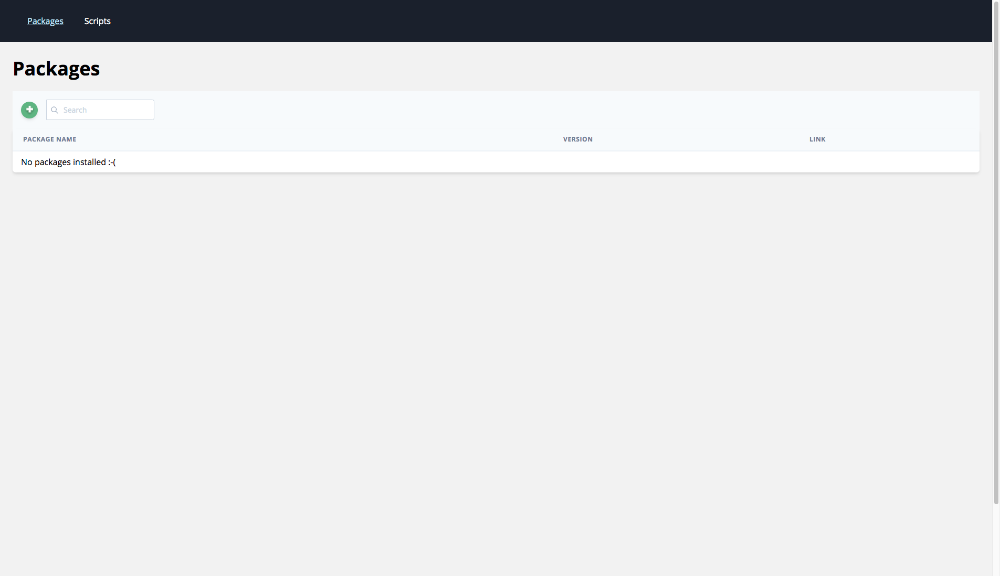
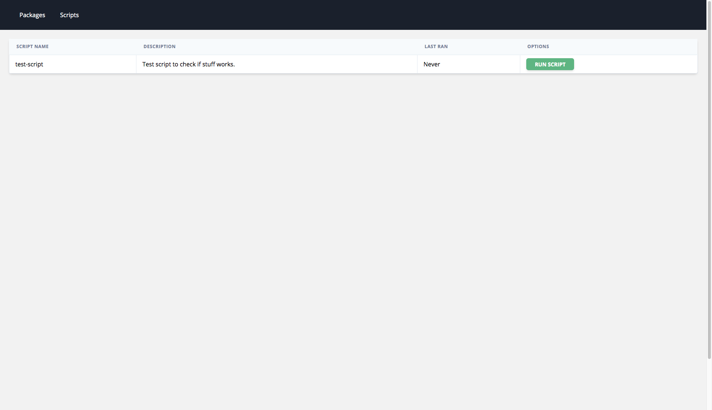

Scriptr is a clean, easy-to-use, easy-to-setup tool to host and administrate all your Node.js scripts.

Scriptr features easy setup via either 1-click DigitalOcean deployments, Docker images, or self-deployed.

### Usage

To use the project manually, first clone from Github.

Afterwards, run `npm install` to install all packages.

If you want to run in dev, just do `npm run dev`, or if you just want to run the Next.js frontend `npm run next:dev`.

The API will now be hosted on `http://localhost:3000/api`, all routes can be found [here](ROUTES.md).

This API is what powers the application itself. Through it, you can create, delete, and update packages and scripts, either through REST, or through the administrator dashboard.

If you navigate to `http://localhost:3000/admin` you will be prompted to login. The default username/password is `scriptr/scriptr`.

Once logged in, you get an easy to use UI for managing all your scripts and custom packages.

#### Notable information

All user installed packages (packages installed through the REST API or the administrator dashboard) are stored in a file in the root directory called `user_packages.json`. This is also the file the API reads data from when it reads back what packages you have installed.

### Key features

- Administration panel
- CLI-options

### Screenshots

